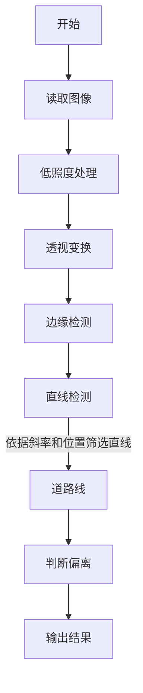

# 基于飞腾平台的车道偏离预警系统

## 工作原理

### 低照度处理

可以采用多帧合一的方法进行低照度处理。

### Sobel 边缘检测

Sobel 以一阶微分为基础进行边缘检测。首先，通过如下卷积计算图像在横向和纵向上的变化：

$$
G_x = \begin{bmatrix}
-1 & 0 & 1 \\
-2 & 0 & 2 \\
-1 & 0 & 1
\end{bmatrix} * A
,\quad
G_y = \begin{bmatrix}
-1 & -2 & -1 \\
0 & 0 & 0 \\
1 & 2 & 1
\end{bmatrix} * A
$$

之后计算每梯度的近似值：

$$
G = \sqrt{G_x^2 + G_y^2}
$$

### Hough 直线检测

一条直线在直角坐标系中可以用斜率和截距来进行表示，而将其表示到极坐标系中也可以使用两个坐标 $(\rho, \theta)$，其中 $\rho$ 表示直线到原点的距离，$\theta$ 表示直线与原点的夹角。表示回直角坐标即为：

$$
y = \left(-\frac{\cos\theta}{\sin\theta}\right)x + \left(\frac{\rho}{\sin\theta}\right)
$$

若使用极坐标系直接表示则为

$$
\rho = x\cos\theta + y\sin\theta
$$

同样，对于每一个点 $(x_0, y_0)$，可以定义经过它的一个直线簇：

$$
\rho_{\theta} = x_0\cos\theta + y_0\sin\theta
$$

若绘制 $\rho$ 随 $\theta$ 的变化，则可以得到一条正弦形状的曲线。对于图像中的所有点，都可以绘制这样的曲线，这一系列曲线的交点 $(\rho_0, \theta_0)$ 即可以表示经过这些点的直线。

## 流程图



## 关键代码分析

系统初始化时需要先对读入的视频流进行处理，设置起编码格式、宽度、高度等信息

```cpp
// 编码格式为YUYV422
capture.set(cv::CAP_PROP_FOURCC, cv::VideoWriter::fourcc('Y', 'U', 'Y', 'V'));
// 宽度 <= 1280
capture.set(cv::CAP_PROP_FRAME_WIDTH, 1280);
// 高度 <= 720
capture.set(cv::CAP_PROP_FRAME_HEIGHT, 720);
// 帧率 <= 30
capture.set(cv::CAP_PROP_FPS, 30);
```

之后对图像应用透视变换，其中透视变换的输入为一个梯形状区域，最后变换到一个矩形区域，模拟车道视角。

```cpp
// 透视变换
cv::Point2f input_quad[4], output_quad[4];
// 设置输入四边形的四个顶点
input_quad[0] = cv::Point2f(0, frame.rows);
input_quad[1] = cv::Point2f(frame.cols, frame.rows);
input_quad[2] = cv::Point2f(0.65 * frame.cols, 0.65 * frame.rows);
input_quad[3] = cv::Point2f(0.35 * frame.cols, 0.65 * frame.rows);
// 设置输出四边形的四个顶点为整个图像的四个角
output_quad[0] = cv::Point2f(0, frame.rows);
output_quad[1] = cv::Point2f(frame.cols, frame.rows);
output_quad[2] = cv::Point2f(frame.cols, 0);
output_quad[3] = cv::Point2f(0, 0);
// 获取透视变换矩阵
cv::Mat lambda = getPerspectiveTransform(input_quad, output_quad);
// 对原始图像应用透视变换
cv::Mat frame_transformed;
cv::warpPerspective(frame, frame_transformed, lambda, frame.size());
```

之后对图像进行边缘检测，使用 Sobel 算子进行边缘检测，首先计算两个方向上的变化量，之后计算对应的梯度，使用 `threshold` 和 `cvtColor` 将最终结果转换为更为清晰的灰度图像。

```cpp
cv::Mat grad_x, grad_y;
cv::Sobel(frame_transformed, grad_x, CV_16S, 1, 0, 3, 1, 0,
            cv::BORDER_DEFAULT);
cv::Sobel(frame_transformed, grad_y, CV_16S, 0, 1, 3, 1, 0,
            cv::BORDER_DEFAULT);
cv::convertScaleAbs(grad_x, grad_x);
cv::convertScaleAbs(grad_y, grad_y);
cv::addWeighted(grad_x, 0.5, grad_y, 0.5, 0, edges);
// 二元值，使边缘更明显
cv::threshold(edges, edges, 40, 255, cv::THRESH_BINARY);
// 转换为灰度图像
cv::cvtColor(edges, edges, cv::COLOR_BGR2GRAY);
```

对边缘检测之后的图像应用 Hough 直线检测

```cpp
// 霍夫直线检测
std::vector<cv::Vec4i> linesP;
cv::HoughLinesP(edges, linesP, 2, CV_PI / 180, 50, 5, 100);
```

之后对检测到的直线根据其斜率和位置进行筛选。

```cpp
// 对检测到的直线进行筛选
std::vector<cv::Vec4i> selected_lines;

// 计算图像 x 轴中点
int mid = frame_transformed.cols / 2;
// 左右直线最长长度
double max_l = 0, max_r = 0;
// 所选择的左右直线
cv::Vec4i line_l, line_r;
for (auto l : linesP) {
    double x1 = l[0], y1 = l[1], x2 = l[2], y2 = l[3];
    // 计算斜率
    double slope = (y2 - y1) / (x2 - x1 + 1e-6);
    // 计算长度
    double length = sqrt((x2 - x1) * (x2 - x1) + (y2 - y1) * (y2 - y1));
    if (abs(slope) < 1 || abs(slope) > 6) {
    // 去除斜率过小或过大的直线
    continue;
    }
    if ((slope > 0 && x1 > mid && x2 > mid && length > max_r) ||
        (slope < 0 && x1 < mid && x2 < mid && length > max_l)) {
    selected_lines.push_back(l);
    if (slope > 0) {
        // 在右侧选择一条最长的直线
        max_r = length;
        line_r = l;
    } else {
        // 在左侧选择一条最长的直线
        max_l = length;
        line_l = l;
    }
    }
}
```

由于在检测过程中可能产生不准确和抖动的情况，所以对连续出现的车道偏离状态进行计数，只有在累计多帧出现这一状态之后才判断为车道偏离。对于每一帧情况下车道偏离的判断通过计算左右两条车道线斜率绝对值之差来实现。

```cpp
float slope_l =
    abs((line_l[3] - line_l[1]) / (line_l[2] - line_l[0] + 1e-6));
float slope_r =
    abs((line_r[3] - line_r[1]) / (line_r[2] - line_r[0] + 1e-6));

float slope_diff = slope_r - slope_l;

int curr_state = 0;

if (abs(slope_diff) < 2) {
    curr_state = 0;
} else if (slope_r < slope_l) {
    curr_state = 1;
} else {
    curr_state = 2;
}

// 状态计数，防止直线检测出现的抖动造成误报警
if (curr_state == state) {
    count++;
} else {
    count = 0;
    state = curr_state;
}

if (count > 3) {
    // 状态累计三帧以上认为是真实状态
    if (state == 1) {
    cv::putText(frame_transformed, "Turn Right", cv::Point(50, 50),
                cv::FONT_HERSHEY_SIMPLEX, 1, cv::Scalar(0, 0, 255), 2);
    } else if (state == 2) {
    cv::putText(frame_transformed, "Turn Left", cv::Point(50, 50),
                cv::FONT_HERSHEY_SIMPLEX, 1, cv::Scalar(0, 0, 255), 2);
    } else {
    cv::putText(frame_transformed, "Go Straight", cv::Point(50, 50),
                cv::FONT_HERSHEY_SIMPLEX, 1, cv::Scalar(0, 255, 0), 2);
    }
} else {
    // 状态累计三帧以下认为是误报警
    cv::putText(frame_transformed, "Go Straight", cv::Point(50, 50),
                cv::FONT_HERSHEY_SIMPLEX, 1, cv::Scalar(0, 255, 0), 2);
}
```

## 关于本项目

本项目为 NKU 2023 暑期实习实训飞腾课程嵌入式 OpenCV 大作业。
