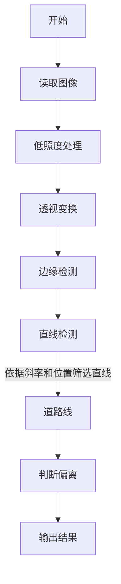

# 基于飞腾平台的车道偏离预警系统

## 工作原理

### 低照度处理

可以采用多帧合一的方法进行低照度处理。

### Sobel 边缘检测

Sobel 以一阶微分为基础进行边缘检测。首先，通过如下卷积计算图像在横向和纵向上的变化：

$$
G_x = \begin{bmatrix}
-1 & 0 & 1 \\
-2 & 0 & 2 \\
-1 & 0 & 1
\end{bmatrix} * A
,\quad
G_y = \begin{bmatrix}
-1 & -2 & -1 \\
0 & 0 & 0 \\
1 & 2 & 1
\end{bmatrix} * A
$$

之后计算每梯度的近似值：

$$
G = \sqrt{G_x^2 + G_y^2}
$$

### Hough 直线检测

一条直线在直角坐标系中可以用斜率和截距来进行表示，而将其表示到极坐标系中也可以使用两个坐标 $(\rho, \theta)$，其中 $\rho$ 表示直线到原点的距离，$\theta$ 表示直线与原点的夹角。表示回直角坐标即为：

$$
y = \left(-\frac{\cos\theta}{\sin\theta}\right)x + \left(\frac{\rho}{\sin\theta}\right)
$$

若使用极坐标系直接表示则为

$$
\rho = x\cos\theta + y\sin\theta
$$

同样，对于每一个点 $(x_0, y_0)$，可以定义经过它的一个直线簇：

$$
\rho_{\theta} = x_0\cos\theta + y_0\sin\theta
$$

若绘制 $\rho$ 随 $\theta$ 的变化，则可以得到一条正弦形状的曲线。对于图像中的所有点，都可以绘制这样的曲线，这一系列曲线的交点 $(\rho_0, \theta_0)$ 即可以表示经过这些点的直线。

## 流程图

## 关于本项目

本项目为 NKU 2023 暑期实习实训飞腾课程嵌入式 OpenCV 大作业。
